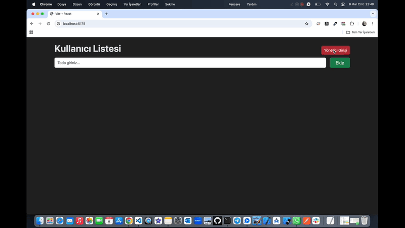

# TodoList 📝

<li>Bu proje bir react hook'u olan useReducer yapısını öğrenmek için oluşturulmuş TodoList arayüzü içerir. </li>
<li>Liste ekleme,silme,admin ve kullanıcı girişi özellikleri mevcuttur.</li>

# Kullanılan Teknolojiler 🎨

<li>React</li>
<li>Vite</li>
<li>Bootstrap</li>
<li>React-dom</li>

# Ekran Görüntüsü 🎥
      

# İletişim 📩
yunusemreoral@hotmail.com.tr

